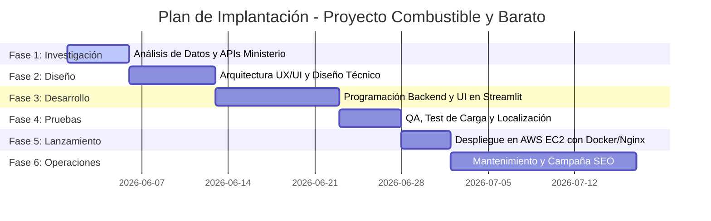

# INFORME EJECUTIVO DEL PROYECTO: COMBUSTIBLE_YBARATO.ES
**Optimización del Gasto en Carburantes en España mediante Inteligencia de Datos**

---

## ÍNDICE DEL INFORME
1. **Descripción del Problema**
   - Contexto del mercado de hidrocarburos.
   - El reto del coste de la información.
   - Paradoja del desplazamiento inútil.
2. **Impacto del Proyecto**
   - Impacto económico (particular y corporativo).
   - Impacto medioambiental (emisiones de CO2).
   - Impacto social y de transparencia de mercado.
3. **Solución Tecnológica Creada**
   - Arquitectura del sistema y flujo de datos.
   - Algoritmo de geolocalización y cálculo de distancias (Fórmula de Haversine).
   - Diseño de interfaz de usuario responsive (UX/UI).
4. **Indicadores Clave de Rendimiento (KPIs)**
   - KPIs financieros y de ahorro.
   - KPIs de rendimiento técnico y de sistemas.
   - KPIs de retención y adopción del usuario.
5. **Riesgos y Plan de Mitigación**
   - Riesgos de disponibilidad de datos y API.
   - Riesgos de usabilidad y técnicos.
   - Riesgos de infraestructura y escalabilidad.
6. **Plan de Implantación**
   - Cronograma por fases (Gantt conceptual).
   - Costes previstos de implantación y operación.

---

## 1. DESCRIPCIÓN DEL PROBLEMA

### Contexto del Mercado de Hidrocarburos en España
En los últimos años, el precio de los combustibles en España (Gasolina 95, Gasolina 98, Gasóleo A, y alternativas renovables) ha experimentado una volatilidad extrema, impulsada por tensiones geopolíticas internacionales, fluctuaciones en el precio del barril Brent y políticas impositivas locales. Esta fluctuación tiene un impacto directo y cotidiano sobre los costes operativos de empresas de logística, transportistas, autónomos y, fundamentalmente, en la economía familiar de millones de ciudadanos españoles.

A pesar de que el mercado de estaciones de servicio es libre y competitivo, existe una gran dispersión de precios. In una misma área metropolitana, o en un radio de apenas 10 kilómetros, el coste del litro de combustible de la misma clase puede variar hasta en un **15% o 20%** entre diferentes operadoras (especialmente entre gasolineras tradicionales con servicio atendido y estaciones automáticas o *low-cost*). Esta diferencia representa un potencial ahorro directo de entre 10 y 15 euros por cada repostaje de un turismo medio.

### El Reto del Acceso a la Información en Tiempo Real
Aunque el Ministerio para la Transición Ecológica y el Reto Demográfico publica diariamente los precios oficiales de todas las estaciones de servicio de España a través de su plataforma Geoportal de Gasolineras, esta información presenta importantes barreras de accesibilidad:
1.  **Falta de optimización para dispositivos móviles:** El Geoportal ministerial es una plataforma pesada, compleja y de difícil manejo desde terminales móviles de usuarios en carretera.
2.  **Complejidad en el filtrado geográfico directo:** Los usuarios necesitan conocer de forma inmediata cuáles son las opciones más baratas en su posición GPS actual sin realizar búsquedas de datos estructurados complejos.
3.  **Volumen masivo de datos:** La base de datos nacional contiene más de 12.000 estaciones de servicio, lo que dificulta su descarga e interpretación en tiempo real en redes móviles inestables.

### La Paradoja del Desplazamiento Inútil
Un problema común que experimenta el usuario es la toma de decisiones ineficiente basada en la falta de cálculo exacto. Muchos conductores deciden desplazarse a una estación de servicio significativamente alejada de su ruta con la premisa de ahorrar dinero, sin calcular si el consumo de combustible derivado del trayecto adicional anula el ahorro en el repostaje. El proyecto aborda esta ineficiencia facilitando la información exacta de distancia (en km reales) combinada con el precio, previniendo decisiones económicamente desfavorables.

---

## 2. IMPACTO DEL PROYECTO

El proyecto `combustible_ybarato.es` genera un impacto multidimensional enfocado en el triple balance: económico, medioambiental y social.

```
       ┌─────────────────────────────────────────────────────────┐
       │                 IMPACTO DE LA SOLUCIÓN                  │
       └────────────────────────────┬────────────────────────────┘
                                    │
         ┌──────────────────────────┼──────────────────────────┐
         ▼                          ▼                          ▼
┌──────────────────┐       ┌──────────────────┐       ┌──────────────────┐
│    ECONÓMICO     │       │  MEDIOAMBIENTAL  │       │      SOCIAL      │
│  Ahorro familiar │       │ Reducción de CO2 │       │   Transparencia  │
│  y empresarial   │       │ por desvíos base │       │   Democratizada  │
└──────────────────┘       └──────────────────┘       └──────────────────┘
```

### Impacto Económico
*   **Para Usuarios Particulares:** Permite reducir el coste anual de combustible de las familias de forma significativa. Tomando como base un consumo anual promedio de 1.200 litros de combustible por vehículo y un ahorro medio identificado de $0,12 \text{ €/litro}$, la solución aporta un ahorro directo neto de aproximadamente **144 € anuales** por vehículo familiar.
*   **Para Flotas Corporativas y Autónomos:** Las microempresas de transporte, autónomos con furgonetas de reparto y flotas locales de distribución pueden utilizar esta herramienta para definir sus paradas de repostaje optimizadas en ruta. El impacto financiero a escala corporativa puede suponer una reducción de entre el **6% y el 10%** de su coste total operativo en combustible.

### Impacto Medioambiental
La optimización geográfica no solo reduce los costes económicos del repostaje, sino que previene las emisiones de dióxido de carbono ($CO_2$) a la atmósfera. Al guiar al usuario a la gasolinera óptima más cercana con la distancia calculada matemáticamente, se mitigan los desplazamientos a ciegas y las pruebas de desvío inútiles. Un ahorro de 1,5 km por cada búsqueda de repostaje, multiplicado por miles de usuarios diarios, genera una reducción drástica de la huella de carbono agregada del proyecto.

### Impacto Social y Transparencia
El proyecto promueve la libre competencia de precios en el sector de la distribución de carburantes en España. Al dotar al consumidor final de una herramienta gratuita, rápida y transparente de comparación directa, se empodera al usuario frente a políticas comerciales complejas de las grandes petroleras y se incentiva a las gasolineras locales a mantener precios altamente competitivos.

---

## 3. SOLUCIÓN TECNOLÓGICA CREADA

La solución desarrollada se conceptualiza como una aplicación web nativa en la nube, ligera y responsive, implementada bajo el stack de desarrollo **Python + Streamlit + Pandas**.

### Arquitectura del Sistema y Flujo de Datos
El núcleo de la aplicación se basa en un flujo estructurado de datos diarios que garantiza información veraz al menor coste computacional:

```
┌──────────────────────────────────────┐
│  Geoportal Ministerio (Fichero XLS)  │
└──────────────────┬───────────────────┘
                   │
                   ▼
┌──────────────────────────────────────┐
│   Descarga Diaria Automatizada       │◄─── Programada (06:00 AM)
└──────────────────┬───────────────────┘
                   │
                   ▼
┌──────────────────────────────────────┐
│   Limpieza y Conversión en Pandas   │
└──────────────────┬───────────────────┘
                   │
                   ▼
┌──────────────────────────────────────┐
│     Caché Local e Indexación         │
└──────────┬───────────────┬───────────┘
           │               │
           ▼               ▼
┌──────────────────┐┌──────────────────┐
│   Filtros GPS    ││ Búsquedas Texto  │
└──────────┬───────┘└───────┬──────────┘
           │               │
           └───────┬───────┘
                   │
                   ▼
┌──────────────────────────────────────┐
│    Cálculo de Distancia (Haversine)  │
└──────────────────┬───────────────────┘
                   │
                   ▼
┌──────────────────────────────────────┐
│  Visualización Pydeck y Tabla HTML  │
└──────────────────────────────────────┘
```

1.  **Ingesta de Datos:** La aplicación se conecta al servidor oficial del Geoportal de Gasolineras del Ministerio y descarga la hoja de cálculo completa en formato `.xls` de forma autónoma.
2.  **Caché Eficiente:** Para evitar sobrecargar los servidores públicos y mejorar la velocidad de carga de la web, se diseñó un algoritmo de refresco diario condicional. Los datos solo se vuelven a descargar si la caché supera las **06:00 AM** del día en curso (momento en el que el Ministerio actualiza los datos nacionales).
3.  **ETL (Extracción, Transformación y Limpieza):** Utilizando la biblioteca **Pandas**, el sistema procesa el archivo Excel:
    - Corrige y limpia la cabecera real (ubicada en la fila 4).
    - Convierte los precios con comas decimales (formato español habitual en el Excel oficial) a formato numérico float estandarizado.
    - Filtra coordenadas erróneas fuera de los límites de España.
    - Omite del set de datos las gasolineras con precios nulos, no reportados o iguales a cero.

### Algoritmo de Cálculo de Distancia (Fórmula de Haversine)
El cálculo de distancia lineal entre la ubicación GPS del usuario y cada estación de servicio se realiza en memoria mediante la fórmula de Haversine, la cual ofrece una precisión métrica óptima para distancias cortas e intermedias sobre el elipsoide terrestre:

$$\text{Distancia (km)} = 2 \cdot R \cdot \arcsin\left(\sqrt{\sin^2\left(\frac{\Delta lat}{2}\right) + \cos(lat_1) \cdot \cos(lat_2) \cdot \sin^2\left(\frac{\Delta lon}{2}\right)}\right)$$

Donde:
*   $R = 6371.0 \text{ km}$ (Radio medio de la Tierra).
*   $lat_1, lon_1$ son las coordenadas GPS de la posición del usuario.
*   $lat_2, lon_2$ son las coordenadas GPS de la estación de servicio.

### UX/UI Responsive Premium
El diseño estético ha sido un pilar estratégico. Se ha desarrollado una interfaz de usuario bajo un tema oscuro moderno, utilizando variables CSS a medida y una estructura de visualización compacta y clara:
*   **Portabilidad Completa:** Adaptación inmediata mediante la función `clamp()` en CSS y contenedores desplazables para las tablas de resultados.
*   **Triple Localización:** Permite al usuario geolocalizarse automáticamente con el GPS de su smartphone, escribir el nombre de su localidad (geocodificada en segundos con OpenStreetMap Nominatim), o configurar coordenadas de forma manual.
*   **Visualización Enriquecida:** Incorpora tarjetas con desenfoque de cristal (Glassmorphism), un mapa tridimensional interactivo con **Pydeck** (que proyecta de forma visual los precios y ubicaciones relativas en tiempo real) y enlaces directos que trazan la ruta en Google Maps con un clic.

---

## 4. INDICADORES CLAVE DE RENDIMIENTO (KPIs)

Para asegurar la viabilidad técnica y comercial del proyecto, se ha implementado un cuadro de mando con indicadores en tres dimensiones clave:

### KPIs Financieros y de Ahorro para el Cliente

| Nombre del KPI | Descripción / Fórmula | Objetivo (Target) |
|---|---|---|
| **Ahorro Medio por Repostaje (AMR)** | Ahorro monetario en € por litro en la zona en comparación con el precio máximo regional. | $\ge 0,10 \text{ €/Litro}$ |
| **Retorno de la Inversión en Repostaje** | Ratio entre la diferencia de precio obtenida y el consumo estimado para desplazarse al local. | $> 3.0$ (ahorro 3x superior al coste de desvío) |
| **Índice de Ahorro Anual Estimado (IAE)** | Ahorro anual acumulado simulado por usuario promedio basado en 1.200 litros/año. | $> 120 \text{ €/año por usuario}$ |

### KPIs de Rendimiento Técnico

| Nombre del KPI | Descripción / Fórmula | Objetivo (Target) |
|---|---|---|
| **Tiempo de Respuesta del Servidor (Latency)** | Tiempo total transcurrido desde la petición de búsqueda del usuario hasta el renderizado de la tabla de resultados. | $< 1,2 \text{ segundos}$ |
| **Disponibilidad de Servicio (Uptime)** | Porcentaje del tiempo total en que el sistema de búsqueda se encuentra online y operativo. | $\ge 99,9\%$ |
| **Tiempo de Procesamiento ETL (ETL_Time)** | Duración del procesamiento, parsing y estructuración del archivo XLS nacional en el inicio diario del servicio. | $< 5 \text{ segundos}$ |
| **Tasa de Geolocalización Correcta** | Porcentaje de geocodificaciones exitosas vía GPS nativo o mediante la API Nominatim. | $> 95\%$ |

### KPIs de Producto y Negocio

| Nombre del KPI | Descripción / Fórmula | Objetivo (Target) |
|---|---|---|
| **Tasa de Rebote (Bounce Rate)** | Porcentaje de visitantes que abandonan la aplicación en los primeros 10 segundos sin realizar búsquedas. | $< 25\%$ |
| **Conversión a Ruta GPS (CTR_Maps)** | Porcentaje de usuarios que hacen clic en el botón "Ver mapa" de Google Maps tras realizar una búsqueda. | $> 40\%$ |
| **Ratio de Actualización de Datos** | Frecuencia de coherencia de los precios comparados con los precios reales de los postes de gasolina. | $100\%$ de correspondencia diaria |

---

## 5. RIESGOS Y PLAN DE MITIGACIÓN

El despliegue y operación continuada de `combustible_ybarato.es` se enfrenta a diversos retos de carácter técnico y operativo. A continuación se desglosan los principales riesgos y sus planes de mitigación:

```
┌─────────────────────────────────┐      ┌─────────────────────────────────┐
│     RIESGO IDENTIFICADO         │      │       PLAN DE MITIGACIÓN        │
├─────────────────────────────────┤      ├─────────────────────────────────┤
│ Caída de API del Ministerio     ├─────►│ Cacheo persistente y local      │
├─────────────────────────────────┤      ├─────────────────────────────────┤
│ Fallo en Permisos GPS           ├─────►│ Fallback a Nominatim y Manual   │
├─────────────────────────────────┤      ├─────────────────────────────────┤
│ Escalabilidad por Tráfico       ├─────►│ Contenerización ligera Docker   │
└─────────────────────────────────┘      └─────────────────────────────────┘
```

### 1. Riesgo de Inestabilidad en la Fuente de Datos del Ministerio (Riesgo Alto)
*   **Descripción:** La descarga de precios diarios depende en su totalidad del servidor del Ministerio. Si el servidor gubernamental experimenta caídas, mantenimiento programado o sobrecarga, la aplicación no podría acceder a los precios vigentes.
*   **Mitigación:** La aplicación implementa un sistema híbrido de persistencia. En caso de fallo en la conexión HTTP con la URL ministerial, el sistema detecta la excepción, mantiene los últimos datos descargados correctos (`preciosEESS_es.xls` local) y despliega un mensaje preventivo en la UI informando al usuario del uso de la copia local sin detener la operatividad.

### 2. Riesgo de Cambios de Estructura en el Fichero Origen XLS (Riesgo Medio)
*   **Descripción:** Una modificación en los nombres de las columnas o en la fila de inicio de cabecera por parte del Ministerio causaría un error en el motor de lectura de Pandas, inhabilitando las consultas.
*   **Mitigación:** Se ha implementado un mapeador de columnas dinámico e insensible a mayúsculas/minúsculas. Además, el script de backend puede ser mejorado con validaciones de esquemas (Pydantic o comprobaciones básicas de columnas) que disparen alertas automáticas en consola para una rápida reconfiguración de la estructura de carga.

### 3. Restricciones de Permisos GPS en Navegadores (Riesgo Medio)
*   **Descripción:** Por motivos de seguridad y privacidad, muchos navegadores o usuarios bloquean activamente el acceso al GPS del dispositivo móvil, inutilizando el botón de geolocalización automática.
*   **Mitigación:** Diseño de localización redundante en tres niveles. Si la función GPS devuelve nulo o falla, la aplicación conmuta automáticamente al motor de búsqueda de ciudades basado en la API de Nominatim OpenStreetMap o habilita de forma destacada el ingreso manual de latitud y longitud.

### 4. Sobrecarga del Servidor por Concurrencia de Usuarios (Riesgo Bajo-Medio)
*   **Descripción:** Streamlit crea sesiones dedicadas para cada usuario conectado, lo que puede provocar un consumo excesivo de memoria RAM si la concurrencia es alta.
*   **Mitigación:**
    - Carga en caché compartida en memoria a nivel de sistema del dataframe principal mediante el decorador `@st.cache_data`. Esto evita que cada sesión de usuario lea el archivo XLS de disco de forma independiente.
    - Configuración de despliegue contenerizado mediante Docker, limitando el uso de CPU y memoria de la app, permitiendo un escalado horizontal fácil en múltiples contenedores con balanceadores de carga como Nginx.

---

## 6. PLAN DE IMPLANTACIÓN

La puesta en marcha completa del proyecto `combustible_ybarato.es` se define a través de un cronograma estructurado en seis fases sucesivas, abarcando desde la investigación hasta la operación comercial del portal.

### Cronograma Conceptual de Implantación



### Desglose Detallado de las Fases

#### Fase 1: Investigación y Análisis (Duración: 5 días)
*   Análisis de los endpoints públicos del Ministerio.
*   Evaluación de la consistencia de los datos contenidos en el fichero Excel.
*   Pruebas previas de procesamiento de los ficheros XLS nacionales en local.

#### Fase 2: Diseño de la Solución (Duración: 7 días)
*   Elaboración del diseño de interfaz móvil interactivo.
*   Modelado lógico del cálculo de distancias (evaluación de la idoneidad matemática de Haversine frente a Vincenty).
*   Diseño de la estrategia de caché diaria para mitigar el consumo de red.

#### Fase 3: Desarrollo del Prototipo (Duración: 10 días)
*   Creación del backend en Python y desarrollo del pipeline ETL con Pandas.
*   Implementación del front-end interactivo a través de Streamlit.
*   Maquetación CSS personalizada para asegurar el diseño premium y la responsividad.
*   Integración del mapa interactivo con Pydeck y de la geocodificación mediante Nominatim.

#### Fase 4: Pruebas y Aseguramiento de Calidad (Duración: 5 días)
*   Pruebas de compatibilidad responsive en navegadores Chrome, Safari, Firefox, tanto en sistemas Android como iOS y de escritorio.
*   Pruebas unitarias de cálculo de distancia.
*   Validación de comportamiento en ausencia de conexión a Internet (uso de la caché offline).

#### Fase 5: Despliegue en Producción (Duración: 4 días)
*   Configuración del VPS en AWS EC2 (instancia de capa gratuita t2.micro).
*   Creación del entorno dockerizado empleando el `Dockerfile` del repositorio.
*   Apertura de puertos (80 y 443 para HTTPS) e instalación de un Proxy Inverso (Nginx) para gestionar el cifrado SSL con Let's Encrypt de forma segura.

#### Fase 6: Mantenimiento y Marketing Digital (Continuo)
*   Monitoreo diario de las métricas de rendimiento (KPIs técnicos).
*   Indexación SEO en buscadores del dominio `combustible_ybarato.es`.
*   Ajustes en la interfaz del usuario en base a los comentarios y CTRs registrados en la demo.

### Estimación Presupuestaria de Implantación (Primer Año)

A continuación se presenta un resumen de costes previstos para el desarrollo, implantación y mantenimiento del portal durante su primer año de operación:

*   **Desarrollo y Diseño de Software (Outsourcing):** 3.500 € (Coste único de desarrollo del MVP y optimizaciones de UI).
*   **Servidor VPS e Infraestructura (AWS EC2 / S3):** 180 €/año (Gratuito en la capa básica inicial durante los primeros meses, asumiendo un crecimiento moderado de tráfico).
*   **Nombre de Dominio y Certificados SSL:** 25 €/año.
*   **Mantenimiento Técnico Correctivo:** 600 €/año.
*   **Inversión en SEO y Lanzamiento Digital:** 1.000 €/año.

**Coste Total Estimado (Año 1):** **5.305 €**
*(Coste mensual amortizado de mantenimiento recurrente a partir del Año 2: ~100 €/mes).*
